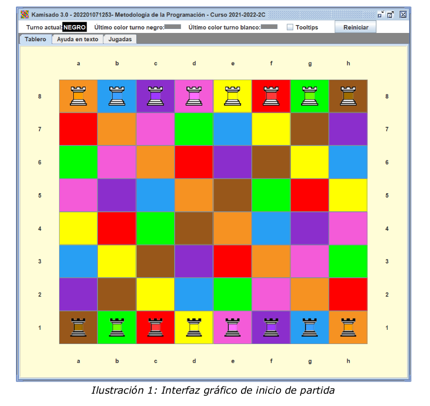

<h1> KAMISADO </h1>

 

`Es una variante simplificada del juego Kamisado. A continuación
se describen las reglas del juego.`

 
 
Es un juego abstracto de tablero de 8x8 celdas, para dos jugadores. Las celdas tienen un color asig-
nado fijo, de entre solo ocho colores posibles (i.e. amarillo, azul, marrón, naranja, púrpura, rojo, rosa,
y verde). Sobre dicho tablero se colocan 8 torres1 blancas en la fila superior del tablero, y 8 torres ne-
gras en la fila inferior del tablero. A partir de ahora diremos que las torres tienen un turno, blanco o
negro, según corresponda.  
A cada jugador, se le asignan sus 8 torres correspondientes. Adicionalmente, cada torre además del
turno (blanco o negro), tiene asignado un color de entre esos ocho. La colocación de las torres de
cada turno, al inicio de la partida, coincide con el color de la celda. Por ejemplo, la torre negra de color
amarillo, se colocará en la fila inferior, en la celda de color amarillo.
A continuación se muestra el aspecto que tendrá el juego iniciando la partida (ver Ilustración 1): 

 
 

 

Por simplificacion, siempre comienza la partida el jugador con turno negro. En este primer turno, puede
mover discrecionalmente una de sus torres a otra celda vacía. El color de la celda donde se coloca la to-
rre, determina que en el siguiente turno, el jugador contrario está obligado a mover su torre de dicho
color. 
Por lo tanto, solo es discrecional el primer movimiento de salida. El resto de movimientos están siempre
condicionados por el color de la celda a donde movió en último lugar el jugador contrario.
  
`Los movimientos de las torres están limitados por las siguientes reglas:`
  
•Solo se puede mover una torre del turno actual hacia la fila de inicio del contrario, solo en senti-
do vertical o diagonal (i.e. solo se puede avanzar hacia la fila de partida del contrario, pero
nunca retroceder). 
•No se puede saltar sobre otras torres, independientemente del turno que tengan (ni siquiera
sobre torres propias). 
•No se puede ocupar una celda que contenga otra torre. En este juego no se “comen” o eli-
minan torres del contrario (ni propias).
•El jugador con turno está obligado a mover siempre que haya algún movimiento legal. No pue-
de pasar turno. 
La partida finaliza cuando uno de los jugadores consigue colocar una de sus torres en la fila de sali-
da del turno contrario.  
Para indicar las celdas del tablero, los jugadores utilizarán la misma notación utilizada en el ajedrez, de -
nominada “notación algebraica”. Por ejemplo y según se muestra en la Ilustración 1, la celda [0][0]
sería "a8", la celda [3][4] sería "e5” y la celda [6][5] sería "f2". Cuando se quiere mencionar una jugada
completa, moviendo una torre de una celda origen a una celda destino, se indicarán las dos celdas segui-
das. Por ejemplo: "a1c3" sería una jugada donde se mueve la torre desde la celda [7][0] a la celda en [5]
[2]. 
Si un jugador está obligado a mover una torre, y dicha torre está bloqueada (según las reglas previas),
se considera que hace un movimiento de “distancia cero”, colocando su torre en la misma celda en la
que estaba, y, por lo tanto, el jugador contrario ahora tendrá que mover su torre del color de dicha cel-
da en la que ha quedado bloqueado el contrario. 
Si se diese la situación de que el bloqueo se da en ambos jugadores, denominado bloqueo mutuo o
deadlock, se considera finalizada, dando como perdedor al jugador que provocó dicha situación con un
movimiento de torre. Es decir, pierde el jugador que hizo el último movimiento que no fuera de “distancia
cero”. 

1 Denominadas también “torres dragón”.

`La informacion completa acerca del funcionamiento del juego se encuentra en> doc/Kamisado_3.0.pdf`

